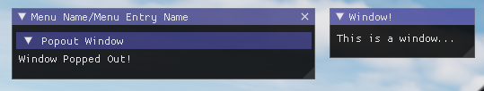

# (Super WIP)

Very early prototype of a Lua Only ImGui Library for DCS World.

## Installation

### Git Submodule

Submodules organize this repository into a different git repository so you can easily update and build. This is the suggested install, but requires a git repository already, if you aren't using git (you should) use the [standalone instructions.](#standalone)

1. Open a git terminal from the root of the project (where the Cockpit folder is).
2. ```git submodule add "https://github.com/08jne01/dcs-lua-imgui.git" Cockpit/Scripts/LuaImGui```
3. ```git submodule update --init --recursive```

### Standalone

Requires cmake, ninja and VS Toolchain (usually all included with Visual Studio Install).

1. ```git clone "https://github.com/08jne01/dcs-lua-imgui.git" LuaImGui```
2. ```cd LuaImGui```
3. ```git submodule update --init --recursive```

### Manual Installation - Binaries

TODO

### Build

1. Open resulting folder in IDE/Command Line of choice, some examples:
    - Visual Studio:
        1. ```Project->Configure LuaImGui```
        2. Select ```LuaImGui.dll``` from play button dropdown.
        3. Select Release instead of Debug
        4. Build->Build ALL
    - VSCode -> with C++ and Cmake extensions:
        1. In the command pallet run ```CMake: Configure```
        2. Select x64-release
        3. In the command pallet run ```CMake: Build```
    - Command Line - CMake with Ninja (VS Developer Command Prompt):
        1. ```cmake -G ninja .```
        2. ```cmake -DCMAKE_BUILD_TYPE=Release -DCMAKE_C_COMPILER=cl.exe -DCMAKE_CXX_COMPILER=cl.exe -DCMAKE_INSTALL_PREFIX=./dcs-lua-imgui/out/install/x64-release -S. -B./out/build/x64-release -G Ninja```
        3. ```cmake --build out/build/x64-release --parallel 30```

2. Copy LuaImGui folder to Cockpit/Scripts (if it isn't there)

## Examples

### Creating Windows

To draw the imgui you need to add items to the imgui context and you need to call Refresh to update the imgui windows. See below.


```lua
-- do at top of file
dofile(LockOn_Options.script_path.."ImGui.lua")
-- Menu Name is button in the bar across the top.
-- Menu Entry name is an entry in that menu.
-- Menus are created automatically as items are assigned to them.
-- Menu Entries are not unique so you can have multiple of the same name, 
-- it may result in strange behaviour though.
ImGui.AddItem("Menu", "Menu Entry Name", function() 
    -- Code goes here
end)

-- ImGui.Refresh() needs to be called in every lua state (device).
-- Every time Refresh is called imgui window will update.
function update()
    ImGui.Refresh()
end
```


### Immediate Drawing


```lua
-- This simply prints Text! to the imgui window
-- Any variable passed to ImGui:Text will automatically
-- be converted to a string using the tostring method.
ImGui:Text("Text!")
```

#### Capturing State


```lua
-- Outside the AddItem code
local some_state = {
    hello = "world"
}

ImGui.AddItem("Menu Name", "Menu Entry Name", function() 
    -- You can capture state.
    -- This will show 
    -- {
    --    hello = "world"
    -- }
    -- Here ImGui.Serialize is a helper function
    -- which converts tables and their children to strings.
    local s = ImGui.Serialize(some_state)
    ImGui:Text(s)
end)
```

#### Tables


```lua
-- You can write Tables (not lua tables) to organize your data.
-- The first row is the header this determins the number of columns
-- for the rest of the table, so be sure to make sure it is at least
-- more than the other rows.
ImGui:Table({
    { "Name", "Speed (kts)", "Mass (kg)" },
    { "A-4E", 585, 4469 },
    { "F-100D", 803, 9525 },
    { "Sopwith Camel" }, -- You don't have to have the same number of Columns
})
```

If you don't have the same number of columns as the header the empty ones will be filled with ```nil```.

### Control Statements

Any ImGui functions which control flow will take a function this is because DCS is multithreaded so LuaImGui has to build a set of commands to send to the Render Thread.

This has the side-effect of requiring that all code within the imgui statements to be executed. So any control flow functions that take a function will execute that function regardless of the state of the control flow.

These statements can be combined recursively and with the [Immediate Drawing](#immediate-drawing) imgui commands. To create complex graphical structures.

Most control flow functions share the below model.

```lua
-- s is usually a string unique (to the current scope)
-- f is a function which takes no parameters
function ImGui:Something(s, f)
    ImGui:BeginSomething(s)
    f()
    ImGui:EndSomething()
end
```

Since it is easy to pass anonymous function around it makes the syntax easy and similar to normal ImGui.

### Tree

Tree Closed


Tree Open


Tree's can be combined recursively (like an imgui element) to make a complex structure.

```lua
-- Openable Menu with Indent - You can recursively combine these to make complex structures.
ImGui:Tree("Some Tree", function() 
    ImGui:Text("Some Hidden Text")
end)
```

#### Header

This produces an openable menu but unlike Tree there is no indent.

Header Closed


Header Open


```lua
-- Open-able Menu without Indent.
ImGui:Header("Some Collapsable Header", function() 
    ImGui:Text("Some More Hidden Text")
end)
```

#### TabBar

This produces a menu with multiple tabs where one tab is displayed at a time depending on what the user selects. Other ImGui elements can be put inside like other control statements allowing for creating complex recursive structures.

Tab 1 Selected


Tab 2 Selected


```lua
ImGui:TabBar("Some Tabs", function()
    for i=1,5 do
        ImGui:TabItem(string.format("Tab %d", i), function() 
            ImGui:Text(string.format("This is a tab: %d", i))
        end)     
    end
end)
```

#### Window

`ImGui:Window` lets you create a floating window from the current window. It will only show if the control code it is in is active (ie tree/header open or window is open). This lets you build complex pop outs which depend on other windows.



```lua
ImGui:Header("Popout Window", function()
    ImGui:Text("Window Popped Out!")
    ImGui:Window("Window!", function() 
        ImGui:Text("This is a window...")
    end)
end)
```

### Utility

#### Serialize

This function converts any table (and its metatable) and all its members into a string similar to how a table is defined in lua (not exactly the same). This makes it easy to inspect lua datastructures.

```lua
-- note . 
-- not :
local s = ImGui.Serialize({
    plane = "A-4E",
    planet = "Earth",
    another_table = {
        hello = 5,
        world = "something"
    }
})

ImGui:Text(s)
```


